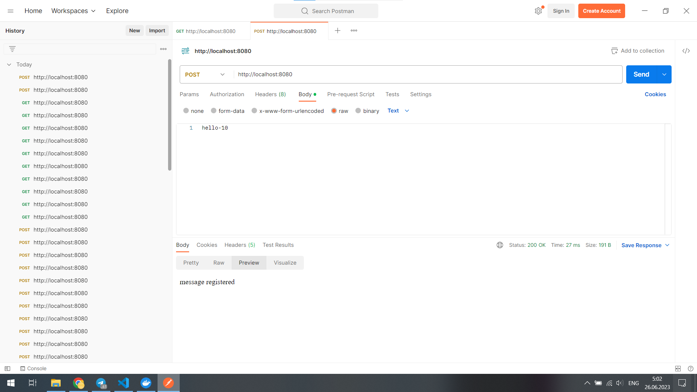
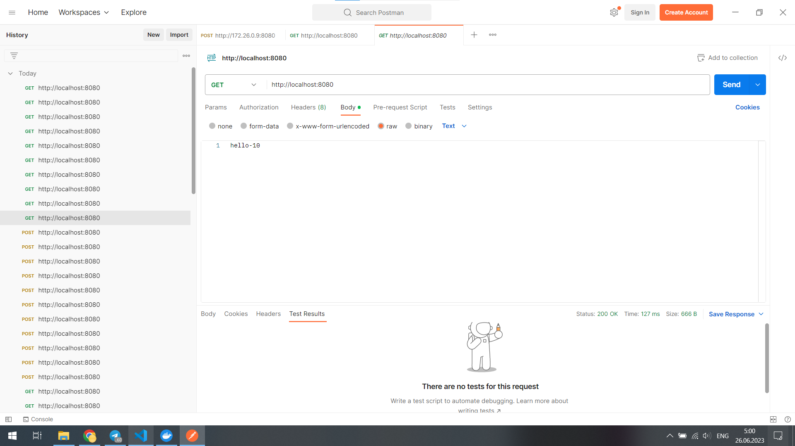
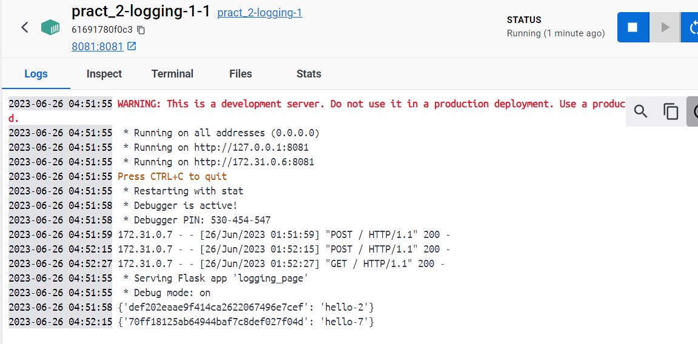
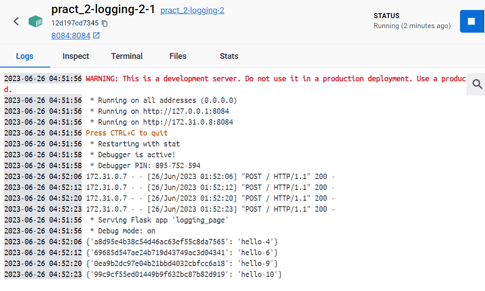
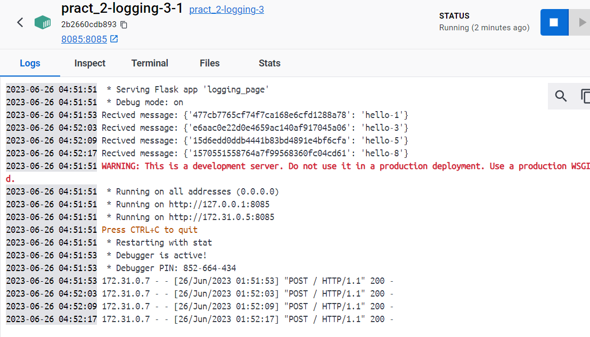
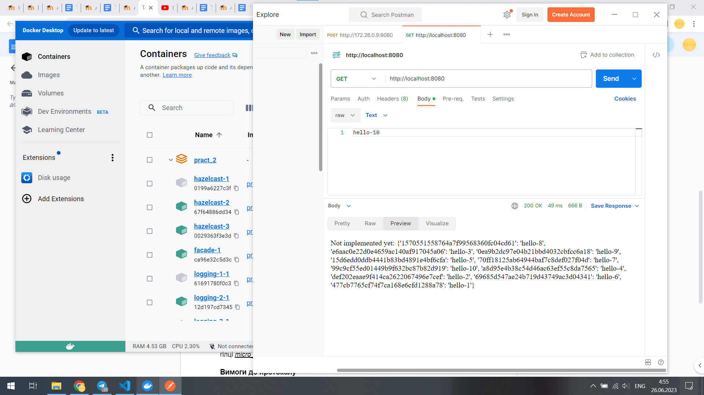
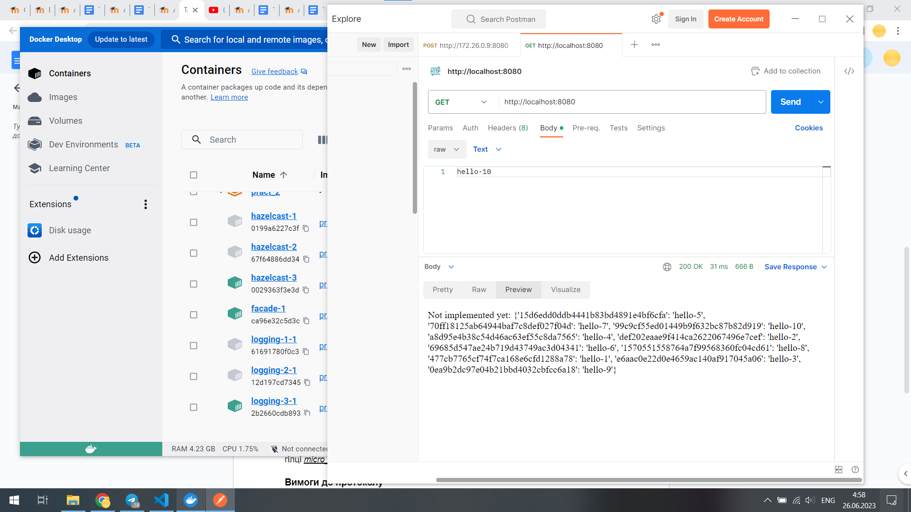

# Homework_SWA

У цій домашці реалізовано збереження логів на Hazelcast нодах чрез logging-service.

Hazelcast ноди та logging-service ноди запускаються окремо, але для кожної lodding ноди є своя відповідна hazelcast нода.

Facade-service рандомно вибирає одну з доступних нод, щоб надсилати логи.

Увесь проект запескається черех docker-compose

Щоб запустити проект:
```
$> docker-compose build
$> docker-compose up -d
```

Щоб вимкнути все:
```
$> docker-compose down
```

## Надсилання запитів

Ось приклади успішного надсиання POST та GET запитів на facede-service





Оскільки ноди для логування вибираються випадковим чином, то кожна буде мати свої меседжі, але при витягування всіх повідомлень, кожна нода може вернути всі повідомлення, що були залоговані.







Також, завдяки hazelcast навіть при вимкнені одної чи двох нод логування і hazelcast всі повідомлення лишаються збереженими



