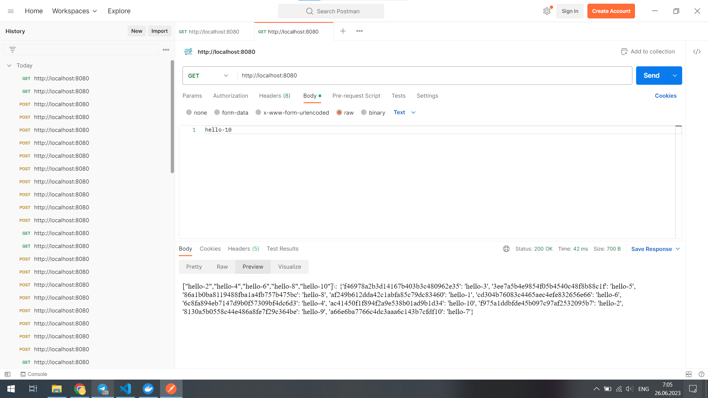
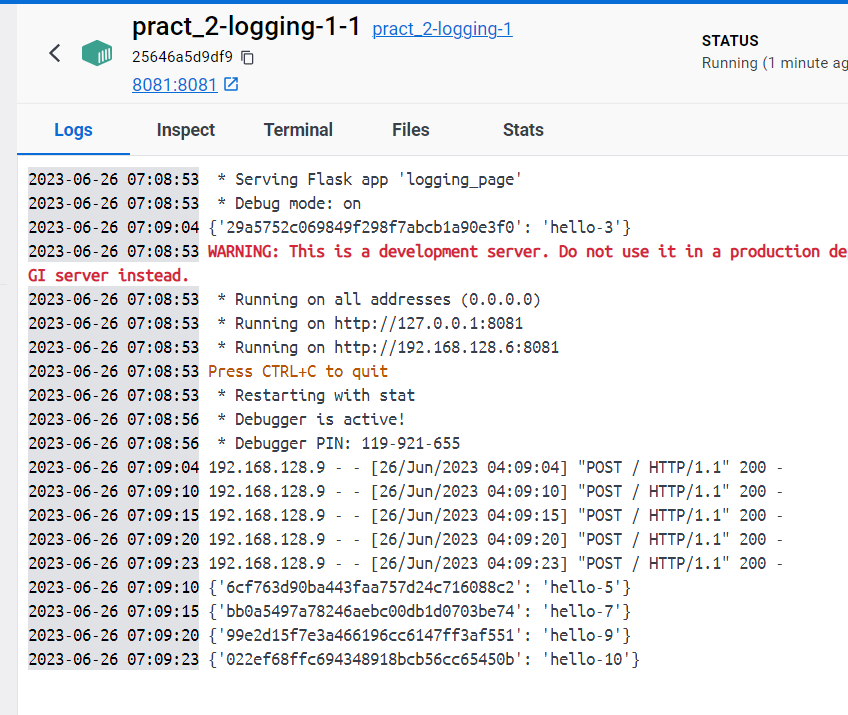
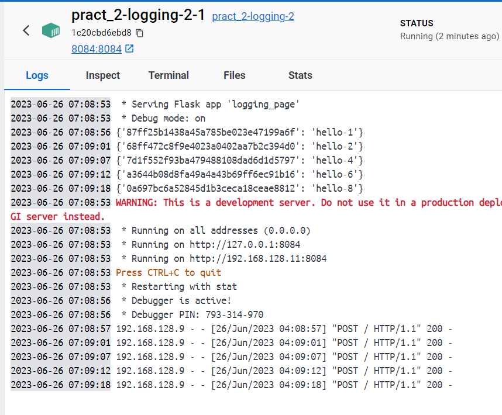
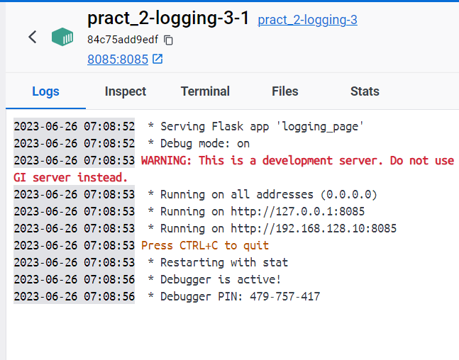
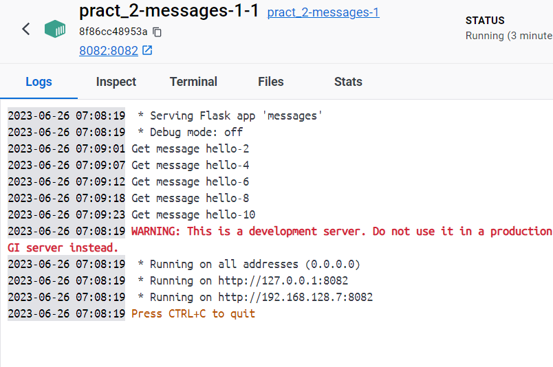
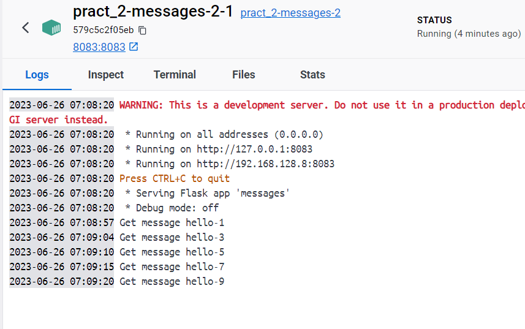

# Homework_SWA

У цій домашці реалізовано збереження логів на Hazelcast нодах чрез logging-service та мпілкування з messages-service через чергу повідомлень реалізовану на основі hazelcast та Get запити.

Hazelcast ноди та logging-service ноди запускаються окремо, але для кожної lodding ноди є своя відповідна hazelcast нода.
Так само окремо запескається нода hazelcast-queue через яку messages-service та facade service доступаються до MQ.

Facade-service рандомно вибирає одну з доступних нод, щоб надсилати логи, а повідомлення просто кидає в чергу.
При GET запиті, вже вибирається одна з доступних нод messages-service з якої читати повідомлення.

Увесь проект запескається черех docker-compose

Щоб запустити проект:
```
$> docker-compose build
$> docker-compose up -d
```

Щоб вимкнути все:
```
$> docker-compose down
```

## Надсилання запитів

Ось приклади успішного надсиання POST та GET запитів на facede-service
Можна бачити, що при записі 10 повідомлень, деякі попали на одну ноду повідомлень, а деякі на іншу. А у результаті GET запиту отримуємо зліплену множину з logging-service та одної з нод message-service

POST

GET



Оскільки ноди для логування вибираються випадковим чином, то кожна буде мати свої меседжі, але при витягування всіх повідомлень, кожна нода може вернути всі повідомлення, що були залоговані.







При надсиланні повідомлень, вони відправляються в чергу, де їх зчитує одна або друга messages-service ноди.
Ось їх логи



