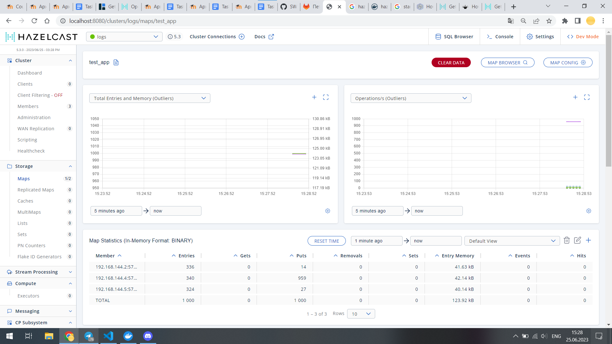
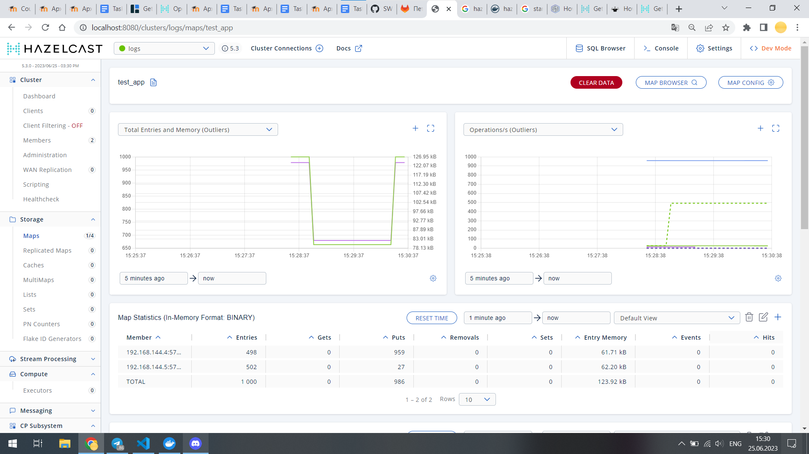
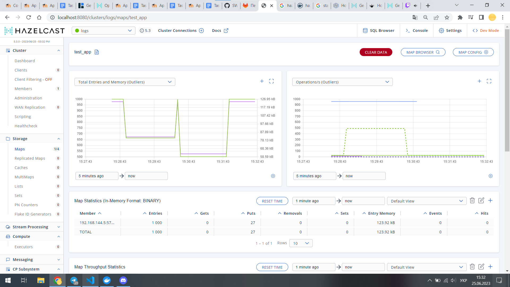
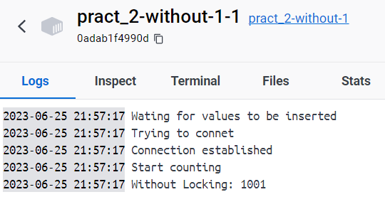
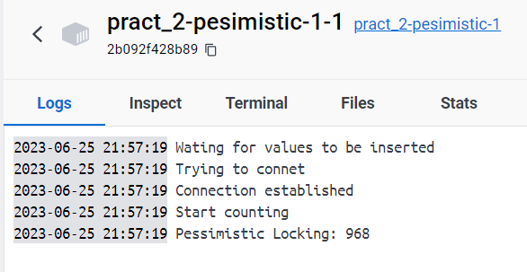
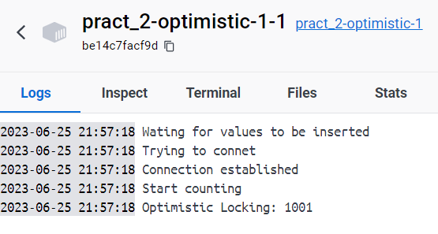
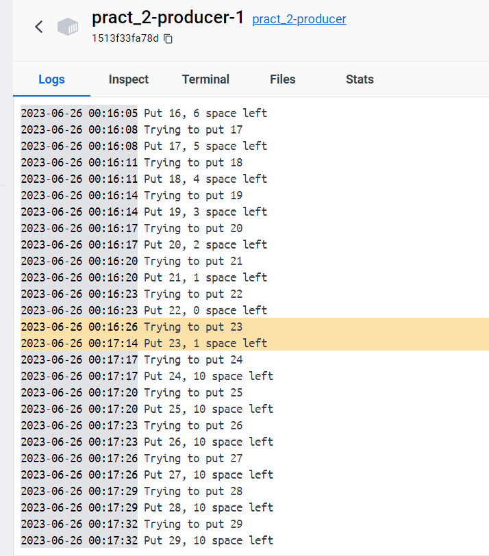
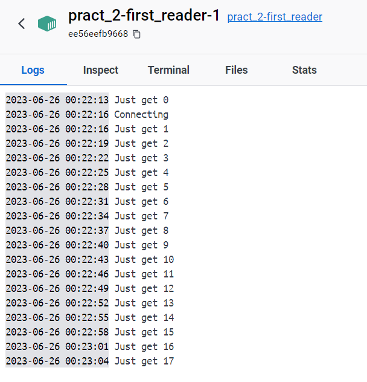
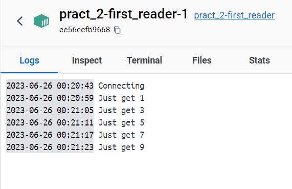
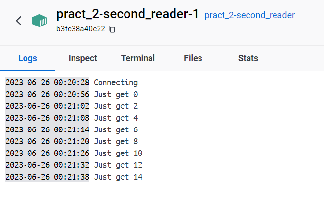

# Homework_SWA

Увесь проект запескається черех docker-compose

Щоб запустити проект:
```
$> docker-compose build
$> docker-compose up -d
```

Щоб вимкнути все:
```
$> docker-compose down
```


Для завдань 1 та 2 я просто запустив 3 докер контейтера з імаджем hazelcast і вказав првильні порти для port-forwarding

## Завдання 3

У папці ```task-1``` лежить файл з кодом для запису 1000 повідомлень в distributed_map та Dockerfile для збирання цього коду в докер.
Також цей код створює мапи для наступниого завдання

### Розподіл даних по нодах

Можна бачити, що дані розмодаляються рівномірно по всіх 3 нодах




Якщо вимкнути 1 ноду, дані розподіляться по тих двох, що залишились



Якщо ж вимкнути ще одну, то всі дані будуть зберігатись на тій одній, що залишилась. Втрати даних не спостерігається




## Завдання 4

У цьому завданні я запустив додатково по 3 докер контейнера для коного з блокувань, з кодом, що був у офіційних прикладах.

Вийшли досить цікаві результати. Оптимістичне блокування показало себе як і очікувалось, без жодних втрат, а ось песимістичне блокувння призвело до невеликох страти данних. На диво програма що працбвала взагалі без блокувань також змогла отримати всі дані без втрат. 






## Завдання 5

У цьому завданні потрібно було сконфігурувати bounded-queue. Для цього при збирання контейтера з hazelcast я заміняю файли з конфігами на власні з тими значеннями, що мені потрібні.

Такми чином отримано чергу з лімітом у 10 значень.
Якщо в таку чергу записувати значення без зчитування, то вона перповниться і наступні значення не зможуть записатись, поки не будуть зчитані старі.

Це видно на наступному скріншоті, де звичайний інтервал між записами - 3с. але коли черга переповниться, потік буде чекати поки не зможе записати значення.



Якщо ж просто записувати і зчитувати значення з черги одним читачем, ми побачимо звичайну поведінку.



Якщо ж читачів буде більше ніж один, вони по черзі вичитуватимуть значення.





